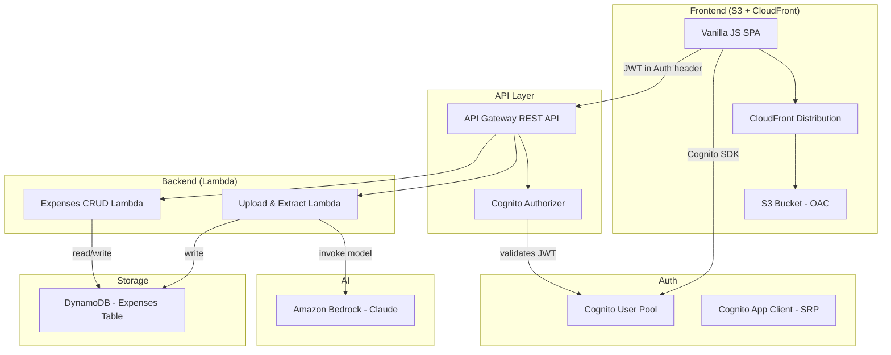

# Design Document: Expense Submission App

## Overview

The Expense Submission App is a serverless single-page application (SPA) on AWS that allows authenticated users to upload receipt images, extract expense details via Amazon Bedrock (Claude), review/edit the extracted data, and persist accepted expenses. The frontend is a Vanilla JS SPA served through CloudFront/S3. The backend consists of Python Lambda functions behind API Gateway, authenticated via Cognito, with DynamoDB for persistence.

### Key Design Decisions

- **Vanilla JS SPA**: No framework overhead; simple routing via hash-based navigation. Aligns with the serverless-spa-frontend skill.
- **Base64 image upload**: Receipt images are base64-encoded on the client and sent as JSON payloads to the API. This avoids the complexity of pre-signed S3 URLs for a simpler MVP flow, at the cost of a ~33% payload size increase. The 5 MB file limit keeps this manageable within API Gateway's 10 MB payload limit.
- **Bedrock direct invocation**: The Lambda calls Bedrock synchronously during the API request. Simple try/catch error handling — if Bedrock fails, return an error to the client.
- **DynamoDB single-table design**: All expense records live in one table, partitioned by user ID (Cognito sub), with a sort key on expense ID for efficient per-user queries.
- **CDK single-stack**: All infrastructure in one CDK stack for simplicity of deployment and teardown.

## Architecture



### Request Flow

1. User authenticates via Cognito (SRP protocol) in the SPA
2. SPA obtains JWT tokens (ID token, access token, refresh token)
3. User selects a receipt image → client validates type/size → displays preview
4. User confirms upload → SPA base64-encodes image → POST to `/expenses/extract` with JWT
5. API Gateway validates JWT via Cognito Authorizer
6. Upload Lambda sends image to Bedrock with structured extraction prompt
7. Bedrock returns JSON with extracted fields → Lambda validates and returns to SPA
8. SPA displays extracted fields in editable form
9. User reviews, edits, accepts → POST to `/expenses` with JWT
10. Expenses Lambda saves record to DynamoDB (partitioned by user sub)
11. SPA navigates to expense list → GET `/expenses` retrieves user's records

## Components and Interfaces

### Frontend Components

#### AuthModule
Manages Cognito authentication lifecycle using the Amazon Cognito Identity SDK.

```javascript
// auth.js
const AuthModule = {
  init()                    // Check existing session, render auth gate or app
  signUp(email, password)   // CognitoUserPool.signUp → confirmation flow
  confirmSignUp(email, code)// CognitoUser.confirmRegistration
  signIn(email, password)   // AuthenticationDetails + SRP → session tokens
  signOut()                 // CognitoUser.signOut → clear session → show auth gate
  getSession()              // Returns current CognitoUserSession or null
  getIdToken()              // Returns JWT ID token string for API calls
  isAuthenticated()         // Boolean check for valid non-expired session
}
```

#### ReceiptUploader
Handles file selection, validation, preview, and upload.

```javascript
// receipt-uploader.js
const ReceiptUploader = {
  init(containerEl)                    // Set up drop zone and file input
  validateFile(file)                   // Check type (JPEG/PNG/WebP) and size (≤5MB)
  showPreview(file)                    // Render image preview via FileReader
  encodeBase64(file)                   // Convert file to base64 string
  upload(base64Image, contentType)     // POST to /expenses/extract with JWT
  showLoading()                        // Display loading indicator
  hideLoading()                        // Hide loading indicator
  showError(message)                   // Display validation/upload error
}
```

#### ExpenseEditor
Displays extracted fields for review and editing.

```javascript
// expense-editor.js
const ExpenseEditor = {
  init(containerEl)                    // Set up editor container
  render(extractedData)                // Populate form with extracted fields
  recalculateTotal()                   // Sum line items → update total display
  validate()                           // Check required fields (merchant, date, total)
  getExpenseData()                     // Collect all form values as object
  submit()                             // POST to /expenses with JWT
}
```

#### ExpenseList
Displays all accepted expenses for the authenticated user.

```javascript
// expense-list.js
const ExpenseList = {
  init(containerEl)                    // Set up list container
  load()                               // GET /expenses with JWT → render list
  render(expenses)                     // Display expense cards sorted by date desc
  showLoading()                        // Display loading indicator
  showEmpty()                          // Display empty state message
}
```

#### Router
Hash-based SPA routing.

```javascript
// router.js
const Router = {
  init()                               // Listen to hashchange events
  navigate(route)                      // Update hash, trigger render
  getCurrentRoute()                    // Parse current hash
}
// Routes: #/auth, #/upload, #/edit, #/expenses
```

### Backend Components

#### Upload & Extract Lambda (`extract_handler.py`)

```python
def handler(event, context):
    """POST /expenses/extract
    - Extracts user_id from Cognito authorizer claims
    - Decodes base64 image from request body
    - Calls Bedrock with structured prompt
    - Parses JSON response
    - Validates required fields
    - Returns extracted data to frontend
    """

def call_bedrock(image_bytes: bytes, content_type: str) -> dict:
    """Invoke Bedrock Claude model with image and extraction prompt."""

def parse_bedrock_response(response_text: str) -> dict:
    """Parse JSON from Bedrock response."""

def validate_extraction(data: dict) -> bool:
    """Ensure merchant_name, date, total_amount are present."""
```

#### Expenses CRUD Lambda (`expenses_handler.py`)

```python
def handler(event, context):
    """Routes based on HTTP method:
    - POST /expenses → create_expense
    - GET /expenses → list_expenses
    """

def create_expense(user_id: str, expense_data: dict) -> dict:
    """Validate, generate ID, save to DynamoDB, return record."""

def list_expenses(user_id: str) -> list:
    """Query DynamoDB by user_id, return sorted by date desc."""
```

### API Endpoints

| Method | Path | Auth | Description |
|--------|------|------|-------------|
| POST | `/expenses/extract` | Cognito JWT | Upload receipt image, extract details via Bedrock |
| POST | `/expenses` | Cognito JWT | Save accepted expense record |
| GET | `/expenses` | Cognito JWT | List all expenses for authenticated user |

All endpoints return JSON with consistent error format:
```json
{
  "error": {
    "code": "ERROR_CODE",
    "message": "Human-readable description"
  }
}
```

### Infrastructure (CDK)

```typescript
// lib/expense-app-stack.ts
class ExpenseAppStack extends cdk.Stack {
  // Auth
  userPool: cognito.UserPool
  userPoolClient: cognito.UserPoolClient

  // API
  api: apigateway.RestApi
  cognitoAuthorizer: apigateway.CognitoUserPoolsAuthorizer

  // Lambdas
  extractFunction: lambda.Function    // Python, Bedrock access
  expensesFunction: lambda.Function   // Python, DynamoDB access

  // Storage
  expensesTable: dynamodb.Table       // PK: userId, SK: expenseId

  // Frontend hosting
  siteBucket: s3.Bucket
  distribution: cloudfront.Distribution  // OAC to S3

  // Observability
  extractLogGroup: logs.LogGroup      // 14-day retention, DESTROY on teardown
  expensesLogGroup: logs.LogGroup     // 14-day retention, DESTROY on teardown
}
```

## Data Models

### Expense Record (DynamoDB)

| Attribute | Type | Description |
|-----------|------|-------------|
| `userId` (PK) | String | Cognito user sub |
| `expenseId` (SK) | String | UUID v4 |
| `merchantName` | String | Merchant/vendor name |
| `date` | String | Expense date (ISO 8601: YYYY-MM-DD) |
| `totalAmount` | Number | Total expense amount |
| `currency` | String | Currency code (e.g., USD, EUR) |
| `taxAmount` | Number | Tax amount (optional) |
| `paymentMethod` | String | Payment method (optional) |
| `lineItems` | List | Array of line item objects |
| `category` | String | Expense category (optional) |
| `status` | String | Record status (e.g., "accepted") |
| `createdAt` | String | ISO 8601 timestamp |
| `updatedAt` | String | ISO 8601 timestamp |

#### Line Item Object

| Attribute | Type | Description |
|-----------|------|-------------|
| `description` | String | Item description |
| `quantity` | Number | Item quantity |
| `unitPrice` | Number | Price per unit |

### Bedrock Extraction Prompt Response Schema

```json
{
  "merchant_name": "string",
  "date": "string (YYYY-MM-DD)",
  "total_amount": "number",
  "currency": "string",
  "tax_amount": "number | null",
  "payment_method": "string | null",
  "line_items": [
    {
      "description": "string",
      "quantity": "number",
      "unit_price": "number"
    }
  ],
  "category": "string | null"
}
```

### Frontend Expense Object

The frontend works with a JavaScript object that mirrors the DynamoDB schema, with camelCase field names. Conversion between snake_case (API) and camelCase (frontend) happens in the API client layer.

```javascript
{
  expenseId: "uuid",
  merchantName: "string",
  date: "YYYY-MM-DD",
  totalAmount: 0.00,
  currency: "USD",
  taxAmount: 0.00,
  paymentMethod: "string",
  lineItems: [{ description: "", quantity: 1, unitPrice: 0.00 }],
  category: "string",
  status: "accepted",
  createdAt: "ISO8601",
  updatedAt: "ISO8601"
}
```


## Correctness Properties

*A property is a characteristic or behavior that should hold true across all valid executions of a system — essentially, a formal statement about what the system should do. Properties serve as the bridge between human-readable specifications and machine-verifiable correctness guarantees.*

### Property 1: Password policy validation

*For any* string, the password validation function should accept it if and only if it has at least 8 characters and contains at least one uppercase letter, one lowercase letter, one digit, and one symbol.

**Validates: Requirements 1.6**

### Property 2: File upload validation with correct error reason

*For any* file with a given MIME type and size, the validation function should accept it if and only if the type is one of JPEG, PNG, or WebP and the size is ≤ 5 MB. When rejected, the error message should indicate the specific failure reason (unsupported type, size exceeded, or both).

**Validates: Requirements 2.1, 2.2**

### Property 3: Bedrock response parsing extracts and validates all fields

*For any* valid JSON object containing the expected receipt fields, the parse function should extract merchant_name, date, total_amount, currency, tax_amount, payment_method, line_items, and category, and should reject any response missing the required fields (merchant_name, date, total_amount).

**Validates: Requirements 3.2, 3.3**

### Property 4: Line item total calculation

*For any* list of line items (each with a quantity and unit price), the calculated total should equal the sum of (quantity × unitPrice) for each line item.

**Validates: Requirements 4.3**

### Property 5: Expense submission validation

*For any* expense data object, the validation function should accept it if and only if merchant name, date, and total amount are all non-empty.

**Validates: Requirements 4.4**

### Property 6: Expense record completeness

*For any* valid expense input, the record produced for storage should contain all required attributes: expense ID, user ID, merchant name, date, total amount, currency, tax amount, payment method, line items, category, status, createdAt, and updatedAt.

**Validates: Requirements 5.2**

### Property 7: Expense list date ordering

*For any* list of expense records, after sorting for display, each expense's date should be greater than or equal to the date of the expense that follows it (most recent first).

**Validates: Requirements 6.3**

### Property 8: User data isolation

*For any* two distinct user IDs, querying expenses for user A should never return any expense record belonging to user B.

**Validates: Requirements 7.3**

## Observability and Logging

### Structured Logging Pattern (Python Lambda)

All Lambda handlers use JSON-structured logging via Python's `logging` module with a custom formatter:

```python
import logging
import json
import os

LOG_LEVEL = os.environ.get('LOG_LEVEL', 'INFO')

class JsonFormatter(logging.Formatter):
    def format(self, record):
        log_entry = {
            'timestamp': self.formatTime(record),
            'level': record.levelname,
            'message': record.getMessage(),
            'logger': record.name,
        }
        if hasattr(record, 'request_id'):
            log_entry['request_id'] = record.request_id
        if hasattr(record, 'user_id'):
            log_entry['user_id'] = record.user_id
        if record.exc_info:
            log_entry['exception'] = self.formatException(record.exc_info)
        return json.dumps(log_entry)

logger = logging.getLogger()
handler = logging.StreamHandler()
handler.setFormatter(JsonFormatter())
logger.handlers = [handler]
logger.setLevel(LOG_LEVEL)
```

### Per-Invocation Context Logging

Every Lambda invocation logs:
```python
logger.info('Request received', extra={
    'request_id': context.aws_request_id,
    'user_id': user_id,
    'http_method': event.get('httpMethod'),
    'path': event.get('path'),
})
```

### Bedrock Invocation Logging

```python
import time

start = time.time()
response = bedrock_client.invoke_model(...)
latency_ms = int((time.time() - start) * 1000)

logger.info('Bedrock invocation complete', extra={
    'request_id': context.aws_request_id,
    'model_id': model_id,
    'input_tokens': response.get('usage', {}).get('input_tokens'),
    'output_tokens': response.get('usage', {}).get('output_tokens'),
    'latency_ms': latency_ms,
})
```

### Error Logging

All errors include full stack trace and request context:
```python
except Exception as e:
    logger.error('Handler failed', exc_info=True, extra={
        'request_id': context.aws_request_id,
        'user_id': user_id,
        'error_type': type(e).__name__,
        'error_message': str(e),
    })
```

### CDK Log Group Configuration

```typescript
// Explicit log groups with retention and cleanup
const extractLogGroup = new logs.LogGroup(this, 'ExtractFnLogs', {
  logGroupName: `/aws/lambda/${extractFunction.functionName}`,
  retention: logs.RetentionDays.TWO_WEEKS,
  removalPolicy: cdk.RemovalPolicy.DESTROY,
});

const expensesLogGroup = new logs.LogGroup(this, 'ExpensesFnLogs', {
  logGroupName: `/aws/lambda/${expensesFunction.functionName}`,
  retention: logs.RetentionDays.TWO_WEEKS,
  removalPolicy: cdk.RemovalPolicy.DESTROY,
});
```

### Agent Self-Diagnosis via CloudWatch

When a backend integration test fails, the agent retrieves logs using:
```bash
# Get recent Lambda logs for diagnosis
aws logs filter-log-events \
  --log-group-name /aws/lambda/{function-name} \
  --start-time {epoch-ms-5-min-ago} \
  --filter-pattern "ERROR" \
  --region {region}
```

## Backend Integration Testing Strategy

After CDK deployment, the backend agent runs integration tests to verify all services are working. These tests use the AWS CLI and API tools available to the agent.

### Deployment Verification Checklist

1. **Stack outputs**: Verify ApiEndpoint, UserPoolId, UserPoolClientId, WebsiteURL are present
2. **Cognito**: Create test user, authenticate, obtain JWT tokens
3. **CORS**: Send OPTIONS request to each endpoint, verify headers
4. **Auth gate**: Send request without JWT, verify 401 response
5. **Bedrock extraction**: POST a test image, verify JSON response with extracted fields
6. **Expenses CRUD**: POST an expense, GET expenses list, verify round-trip
7. **CloudWatch logs**: Verify log groups exist and contain entries after invocations

### Integration Test Flow

```
Deploy CDK stack
  → Verify stack outputs
  → Create Cognito test user + authenticate
  → Test CORS on OPTIONS /expenses
  → Test 401 on unauthenticated GET /expenses
  → Test POST /expenses/extract with test image + JWT
  → Test POST /expenses with expense data + JWT
  → Test GET /expenses with JWT
  → Verify CloudWatch log entries exist
  → If any test fails → read CloudWatch logs → diagnose → fix → redeploy → retest
```

## Frontend E2E Testing Strategy

The frontend agent uses Playwright/Chrome DevTools to verify UI behavior against the deployed application.

### E2E Test Scenarios

1. **Auth gate**: Load app → verify sign-in/sign-up form renders
2. **Sign-up flow**: Fill sign-up form → verify confirmation prompt
3. **Sign-in flow**: Sign in with test credentials → verify main app renders
4. **Upload flow**: Select image file → verify preview displays → confirm upload → verify loading indicator
5. **Editor flow**: After extraction → verify editable fields populated → edit a field → verify total recalculates
6. **Accept flow**: Click accept → verify success message → verify navigation to expense list
7. **Expense list**: Verify expenses display with merchant, date, amount → verify most recent first
8. **Validation**: Leave required fields empty → click accept → verify error highlights

### E2E Test Tooling

The frontend agent uses Chrome DevTools MCP tools (take_snapshot, click, fill, navigate_page) or Playwright MCP tools (browser_snapshot, browser_click, browser_type, browser_navigate) to interact with the deployed app in a real browser.

## Error Handling

### Frontend Errors

| Scenario | Handling |
|----------|----------|
| Invalid file type/size | Display specific validation error, do not proceed with upload |
| Network failure during upload | Display retry-able error, retain file selection |
| Bedrock extraction failure | Display error message, offer manual entry option |
| Expense save failure | Display error, retain form data for retry |
| Session expiration | Detect 401 response, redirect to auth gate, prompt re-login |
| Invalid form submission | Highlight missing required fields, display validation message |

### Backend Errors

| Scenario | HTTP Status | Error Code | Handling |
|----------|-------------|------------|----------|
| Missing/invalid JWT | 401 | UNAUTHORIZED | API Gateway rejects before Lambda |
| Invalid request body | 400 | INVALID_REQUEST | Lambda validates and returns error |
| Bedrock JSON parse failure | 422 | EXTRACTION_FAILED | Return error to client |
| Bedrock non-receipt image | 422 | EXTRACTION_FAILED | Return descriptive error |
| Bedrock transient failure | 503 | SERVICE_UNAVAILABLE | Return error, client can retry |
| DynamoDB write failure | 500 | INTERNAL_ERROR | Return error, client retains data for retry |
| DynamoDB read failure | 500 | INTERNAL_ERROR | Return error, client shows retry option |

### Error Response Format

All API errors follow a consistent JSON structure:

```json
{
  "error": {
    "code": "ERROR_CODE",
    "message": "Human-readable description of what went wrong"
  }
}
```

## Testing Strategy

### Unit Tests

Unit tests cover specific examples, edge cases, and error conditions:

- **Password validation**: Test specific valid/invalid passwords (empty string, 7 chars, no uppercase, etc.)
- **File validation**: Test specific file types and boundary sizes (exactly 5 MB, 5 MB + 1 byte)
- **Bedrock response parsing**: Test with well-formed JSON, malformed JSON, missing fields, empty response
- **Total calculation**: Test with zero line items, single item, items with zero quantity/price
- **Expense validation**: Test with all fields present, each required field missing individually
- **Date sorting**: Test with empty list, single item, items with same date
- **Error message sanitization**: Test specific Cognito error types (UserNotFoundException, NotAuthorizedException)

### Property-Based Tests

Property-based tests verify universal properties across randomly generated inputs. Each property test maps to a correctness property defined above.

**Library**: [fast-check](https://github.com/dubzzz/fast-check) for frontend JavaScript tests, [Hypothesis](https://hypothesis.readthedocs.io/) for backend Python tests.

**Configuration**: Minimum 100 iterations per property test.

**Tagging**: Each test is tagged with a comment referencing the design property:

```javascript
// Feature: expense-submission-app, Property 3: Password policy validation
fc.assert(fc.property(fc.string(), (password) => {
  // ... test body
}), { numRuns: 100 });
```

```python
# Feature: expense-submission-app, Property 6: Bedrock response parsing extracts and validates all fields
@given(st.fixed_dictionaries({...}))
@settings(max_examples=100)
def test_bedrock_parsing_extracts_all_fields(data):
    # ... test body
```

**Property test coverage**:

| Property | Test Description | Library |
|----------|-----------------|---------|
| 1 | Password policy accepts/rejects correctly | fast-check |
| 2 | File validation with correct error reasons | fast-check |
| 3 | Bedrock response parsing and validation | Hypothesis |
| 4 | Line item total calculation | fast-check |
| 5 | Expense submission validation | fast-check |
| 6 | Expense record attribute completeness | Hypothesis |
| 7 | Expense list date ordering | fast-check / Hypothesis |
| 8 | User data isolation | Hypothesis |

Each correctness property is implemented by a single property-based test. Unit tests complement these by covering specific edge cases and integration points.
