# Expense Submission App — Agentic Coding Demo

A serverless expense submission application built entirely through agentic coding with Kiro. Users authenticate via Cognito, upload receipt images, get expense details extracted automatically via Amazon Bedrock (Claude Sonnet 4.6), review and edit the extracted data, and view a history of submitted expenses.

The app itself is useful, but the real purpose of this project is to demonstrate how an AI coding agent can lead the full software development lifecycle — from spec creation through implementation, deployment, testing, and debugging — with the human acting as a collaborator rather than the primary coder.

## What This Project Demonstrates

This project showcases Kiro's agentic coding capabilities across the full development lifecycle:

| Capability | How It Was Used |
|---|---|
| **Specs (Requirements → Design → Tasks)** | Started with a rough idea ("expense submission app"), Kiro generated requirements, design doc with architecture diagrams, correctness properties, and a detailed task list with 40+ tasks |
| **Skills (`~/.kiro/skills/`)** | Used `serverless-spa-frontend`, `serverless-spa-backend`, `serverless-spa-bedrock`, `serverless-spa-auth`, `serverless-spa-deployment` for architecture guidelines and implementation patterns |
| **Parallel Subagents** | Split work into backend and frontend specs, then executed both simultaneously using parallel subagent invocation within a single conversation |
| **Triage & RCA (`triage-issue` skill)** | Used structured root cause analysis to diagnose a CORS error that was actually masking a Bedrock model ID issue — followed the explore → diagnose → fix methodology |
| **Memory (`memory` skill)** | Accumulated debugging insights, architecture decisions, and learnings across the session in `project-learnings/` for future reference |
| **Interactive UI Testing** | Agent used Playwright MCP tools to navigate the deployed app in a real browser — sign in, upload receipts, verify extraction, check console errors |
| **CloudWatch Log Analysis** | Agent read Lambda logs via AWS CLI to diagnose backend errors without requiring the human to copy-paste from the AWS Console |
| **Skill Updates** | Updated the `serverless-spa-bedrock` skill with the correct Claude Sonnet 4.6 model ID after discovering the old one was deprecated — improving the skill for future projects |
| **Hooks** | Agent hooks available for automating lint-on-save, test-after-task, and pre-tool-use validation |
| **Steering Files** | Hierarchical steering in `.kiro/steering/` for project-specific guidance that auto-activates based on file context |
| **AWS Documentation MCP** | Used to look up the exact Bedrock model ID, verify cross-region inference profile format, and check model capabilities |
| **AWS CLI MCP** | Used to query CloudWatch logs, verify stack outputs, and test Bedrock invocations directly |

## Architecture

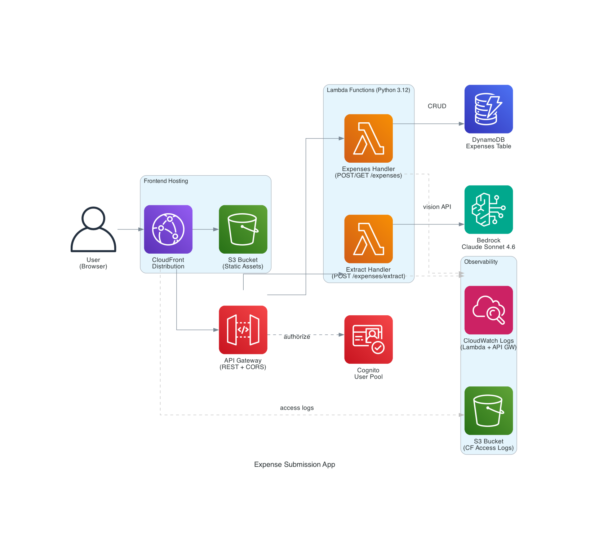

```
CloudFront (SPA) → S3 (static assets)
     ↓
API Gateway (REST, Cognito authorizer)
     ↓
Lambda (Python 3.12)
  ├── Extract Handler → Bedrock (Claude Sonnet 4.6) → receipt JSON
  └── Expenses Handler → DynamoDB (CRUD)
```

All infrastructure defined in a single CDK stack (TypeScript).

## Tools & Technologies

| Layer | Technology |
|---|---|
| Frontend | Vanilla JS SPA, Cognito Identity SDK (CDN), CSS Grid |
| Backend | Python 3.12 Lambda, boto3, structured JSON logging |
| AI | Amazon Bedrock, Claude Sonnet 4.6 (`us.anthropic.claude-sonnet-4-6`) |
| Auth | Amazon Cognito (User Pool, SRP auth, JWT) |
| Storage | DynamoDB (single-table, PAY_PER_REQUEST) |
| Hosting | CloudFront + S3 (OAC, HTTPS redirect) |
| IaC | AWS CDK v2 (TypeScript) |
| Testing | Playwright (frontend E2E), pytest (backend API), bash scripts (Bedrock CLI) |
| Browser Testing | Playwright MCP + Chrome DevTools MCP (agent-driven) |

## UX Screenshots

| Screen | Screenshot |
|--------|-----------|
| Sign In | 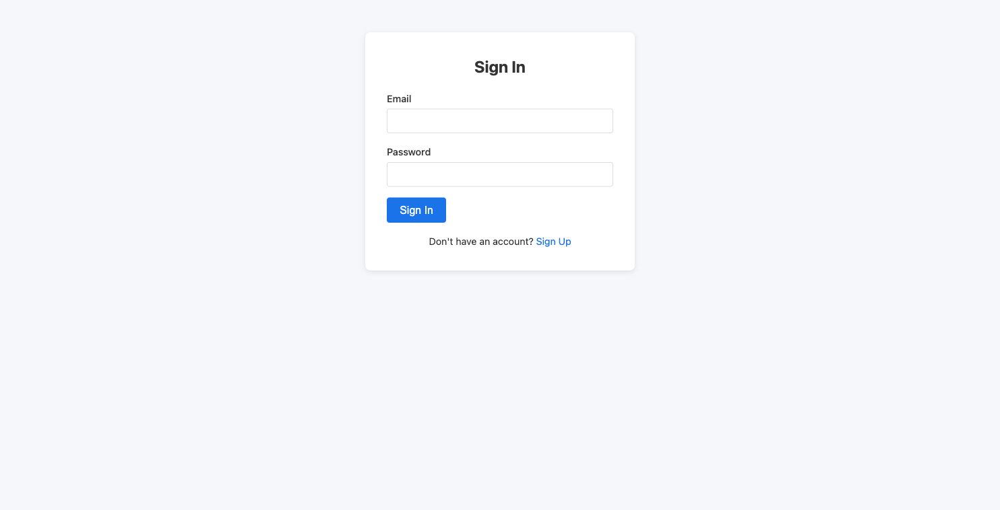 |
| Sign Up | 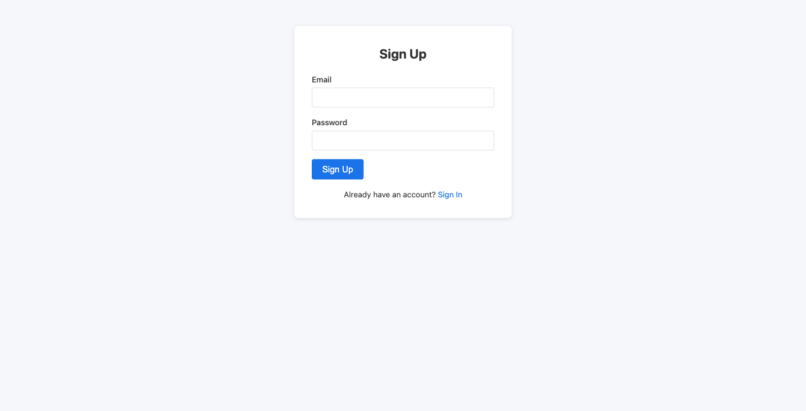 |
| Upload Receipt | 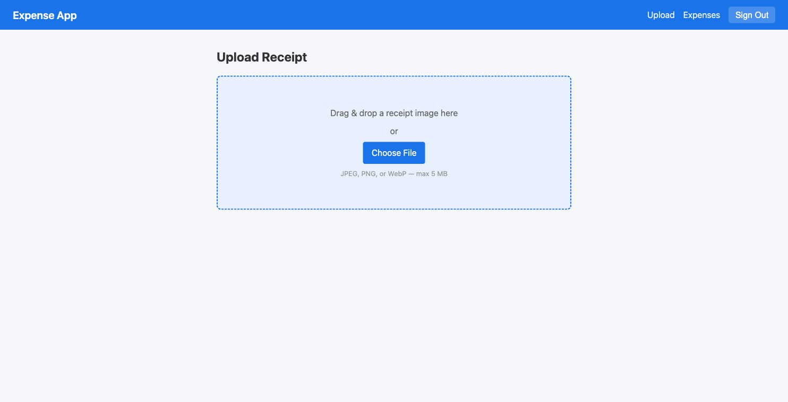 |
| Receipt Preview | 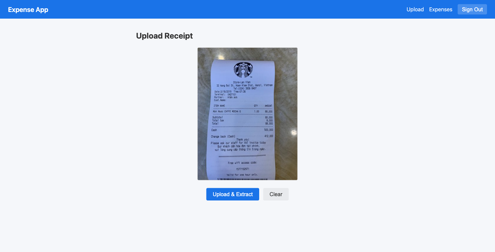 |
| Expense Editor (Bedrock extraction) | 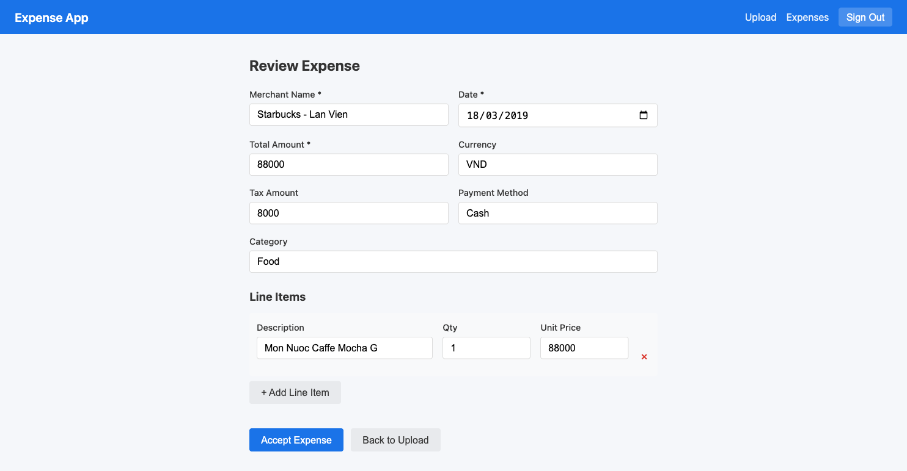 |
| Expense List | 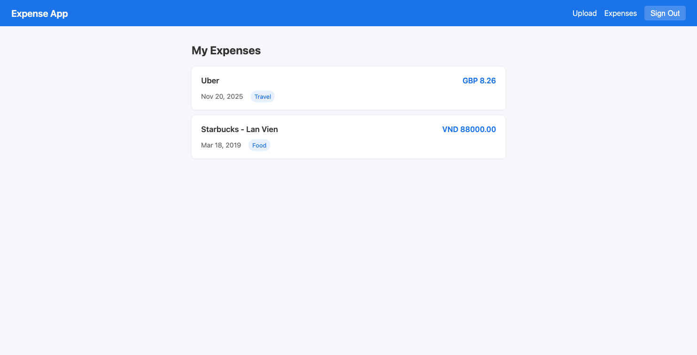 |

## Prerequisites

- Node.js 18+
- Python 3.12+
- AWS CLI configured with credentials
- AWS CDK bootstrapped (`cd cdk && npx cdk bootstrap`)
- Bedrock model access enabled for Claude Sonnet 4.6 in your AWS account

## Installation

```bash
# Install CDK dependencies
cd cdk && npm install && cd ..
```

## Deployment

```bash
# Full deploy: CDK stack + generate config.js + sync frontend to S3 + invalidate CloudFront
./scripts/deploy.sh

# Frontend-only deploy (after code changes, no infra changes)
./scripts/deploy-frontend.sh
```

The deploy script outputs the website URL (CloudFront distribution).

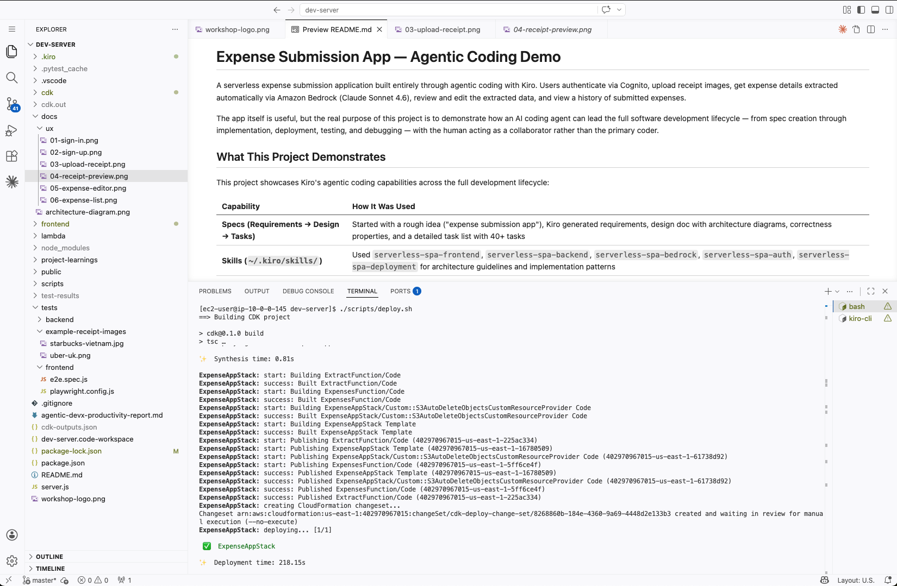

## Troubleshooting

### CDK Install Permission Error on EC2 / Linux

When installing the AWS CDK CLI globally on EC2 (or any Linux environment where you're not root), you may hit:

```
npm error code EACCES
npm error Error: EACCES: permission denied, mkdir '/usr/lib/node_modules/aws-cdk'
```

This is an OS-level file permission issue, not an AWS IAM issue. The `ec2-user` doesn't have write access to `/usr/lib/node_modules/`.

**Option A — Use sudo (quick fix):**

```bash
sudo npm install -g aws-cdk
cdk bootstrap
```

**Option B — Install to user directory (no sudo):**

```bash
npm install -g --prefix ~/.local aws-cdk
export PATH="$HOME/.local/bin:$PATH"
cdk bootstrap
```

Either way, once CDK is installed, `cdk bootstrap` is the real AWS permissions test.

## Creating a Test User

After deployment, create a test user via the Cognito admin API (bypasses email verification):

```bash
# Get your User Pool ID from stack outputs
USER_POOL_ID=$(node -e "const o=JSON.parse(require('fs').readFileSync('cdk-outputs.json','utf8')); console.log(o['ExpenseAppStack']['UserPoolId'])")

# Create user (suppresses verification email)
aws cognito-idp admin-create-user \
  --user-pool-id "$USER_POOL_ID" \
  --username testuser@example.com \
  --temporary-password '<TEMPORARY_PASSWORD>' \
  --user-attributes Name=email,Value=testuser@example.com Name=email_verified,Value=true \
  --message-action SUPPRESS \
  --region us-east-1

# Set permanent password (required — user starts in FORCE_CHANGE_PASSWORD state)
aws cognito-idp admin-set-user-password \
  --user-pool-id "$USER_POOL_ID" \
  --username testuser@example.com \
  --password '<PERMANENT_PASSWORD>' \
  --permanent \
  --region us-east-1
```

Password must meet the Cognito policy: min 8 chars, uppercase, lowercase, digit, and symbol.

## Testing

### Test Dependencies

Install these before running any tests:

```bash
# Playwright for frontend E2E tests
npm install --save-dev @playwright/test
npx playwright install chromium

# Python test dependencies
pip install boto3 requests pytest
```

On EC2 / headless Linux, Chromium may need OS-level libraries. If `npx playwright install chromium` succeeds but the browser fails to launch, install the system dependencies:

```bash
# Amazon Linux 2023 / AL2
sudo yum install -y atk at-spi2-atk cups-libs libxcb libxkbcommon \
  alsa-lib mesa-libgbm libX11 libXext cairo pango \
  libXcomposite libXdamage libXfixes libXrandr at-spi2-core

# Ubuntu / Debian
sudo npx playwright install-deps chromium
```

### Backend API Tests (pytest)

Tests stack outputs, CORS, auth gate (401), and CloudWatch log groups against the live deployment:

```bash
python3.12 -m pytest tests/backend/test_backend_api.py -v
```

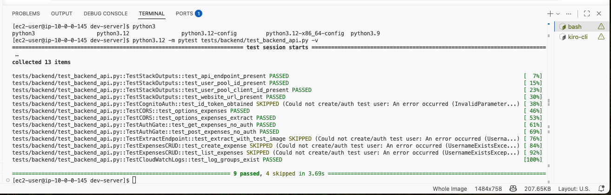

### Frontend E2E Tests (Playwright)

Tests auth flows, upload, editor, expense list against the deployed app:

```bash
# Without auth (unauthenticated tests only)
npx playwright test --config tests/frontend/playwright.config.js

# With auth (full test suite)
TEST_USER_EMAIL=testuser@example.com TEST_USER_PASSWORD='TestPass1!' \
  npx playwright test --config tests/frontend/playwright.config.js

# Visual mode (see the browser — requires a display, local desktop only)
npx playwright test --config tests/frontend/playwright.config.js --headed
```

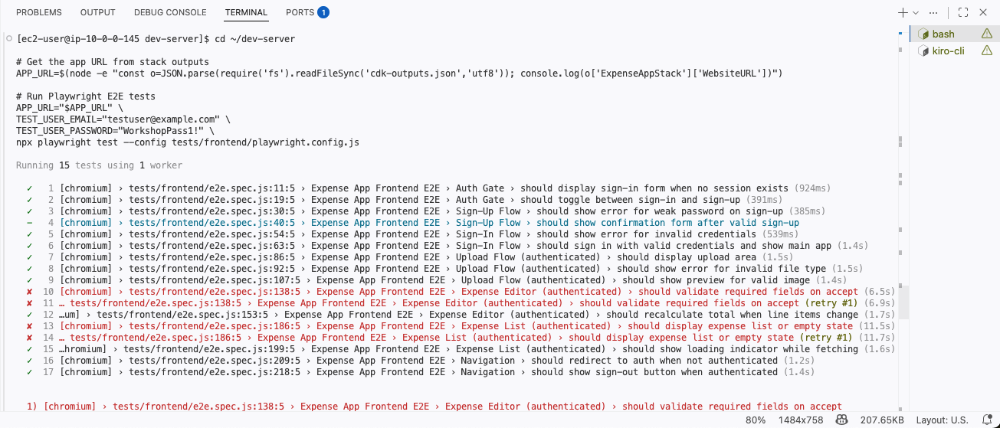

::alert[**Headed vs headless mode:** `--headed` requires a display (X11/Wayland) and only works on local desktops. On EC2 or headless Linux (e.g., Workshop Studio environments), use headless mode (without `--headed`). Headless mode works everywhere.]

### Bedrock CLI Test (bash)

Tests Bedrock model access and receipt extraction directly via AWS CLI, bypassing API Gateway:

```bash
./tests/backend/test-bedrock-aws-cli.sh
```

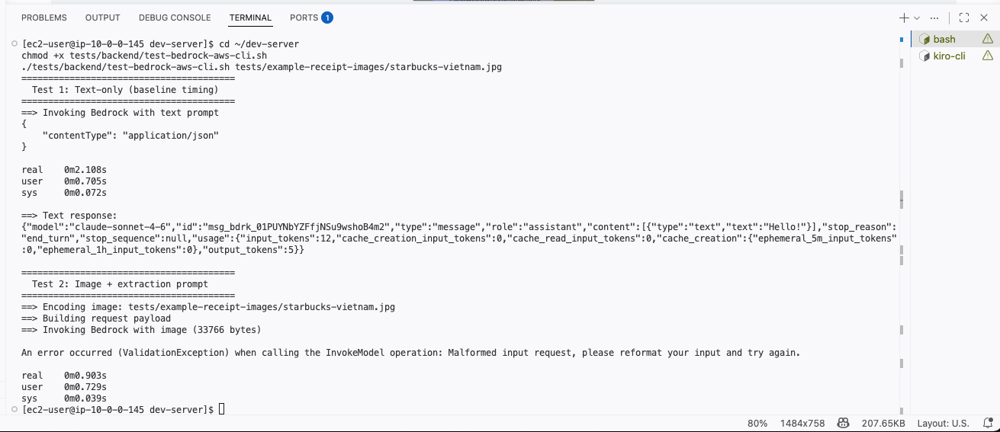

> **Note:** This script base64-encodes the request body, which was required by older AWS CLI versions. If you get a "Malformed input request" error, your AWS CLI may expect the raw JSON body. You can test Bedrock directly with:
> ```bash
> aws bedrock-runtime invoke-model \
>   --model-id us.anthropic.claude-sonnet-4-6 \
>   --content-type application/json --accept application/json \
>   --body '{"anthropic_version":"bedrock-2023-05-31","max_tokens":100,"messages":[{"role":"user","content":[{"type":"text","text":"Say hello"}]}]}' \
>   --region us-east-1 /tmp/test-output.json && cat /tmp/test-output.json
> ```

Runs two tests: a text-only baseline (timing) and an image extraction with the Starbucks receipt.

### CDK Unit Tests

Tests the CDK stack synthesizes correctly with all resources:

```bash
cd cdk && npm test
```

### Interactive Testing with Playwright MCP (Agent-Driven)

Beyond the automated test suites above, you can use Kiro with the Playwright MCP server to interactively test the deployed app through a headless browser. This is especially useful when you're iterating on the UI or debugging a specific flow — the agent navigates the app, takes screenshots, and reports what it sees.

**How it works:**

- Kiro controls a headless Chromium instance via the [Playwright MCP server](https://github.com/anthropics/playwright-mcp-server)
- The browser runs on the same machine as Kiro (e.g., your EC2 instance), not on your local machine
- The agent navigates pages, clicks elements, fills forms, and takes snapshots
- Screenshots are the observation window — there's no live GUI to watch

**Setup:**

Add the Playwright MCP server to your Kiro MCP configuration (`.kiro/settings/mcp.json`):

```json
{
  "mcpServers": {
    "playwright": {
      "command": "npx",
      "args": ["@anthropic-ai/mcp-playwright@latest"],
      "disabled": false
    }
  }
}
```

Make sure Chromium and its system dependencies are installed (see Test Dependencies above).

**Example test flow:**

Ask Kiro to test your deployed app. A typical session looks like this:

1. **Navigate to the app** — The agent opens your CloudFront URL in the headless browser and takes a snapshot. You should see the Sign In page load with email/password fields and a Sign In button.

2. **Test auth page toggle** — The agent clicks "Sign Up" and verifies the form switches to the Sign Up view, then clicks "Sign In" to toggle back. Both transitions should work cleanly.

3. **Test password validation** — The agent switches to Sign Up, enters a weak password (e.g., "123"), and submits. You should see an error: "Password must be at least 8 characters with uppercase, lowercase, number, and symbol."

4. **Test invalid credentials** — The agent switches to Sign In, enters a fake email/password, and submits. You should see: "Incorrect email or password."

5. **Test navigation guards** — The agent clears local storage and tries to navigate directly to a protected route (e.g., `/upload` or `/expenses`). The app should redirect back to the auth page.

6. **Test authenticated flows (optional)** — If you provide test credentials, the agent can sign in, upload a receipt image, verify Bedrock extraction populates the expense editor, save the expense, and check it appears in the expense list.

At any point you can ask the agent to take a screenshot so you can see exactly what the headless browser is rendering. This is useful for visual verification and debugging CSS/layout issues.

**Tips for iterating on the app:**

- After making frontend changes, run `./scripts/deploy-frontend.sh` and ask Kiro to re-test the specific flow you changed
- If a test fails, ask Kiro to check the browser console for JavaScript errors — it can read console output from the headless browser
- For backend issues, Kiro can read CloudWatch logs via the AWS CLI MCP to correlate frontend errors with Lambda failures

## Agent-Led Development Approach

A key learning from this project is how the development workflow shifts when an AI agent leads:

**The human doesn't need to:**
- Copy-paste error logs from the terminal
- Manually check the browser for UI issues
- Look up AWS documentation for model IDs or API formats
- Write boilerplate code or test scaffolding
- Context-switch between AWS Console, terminal, and IDE

**The agent handles:**
- Writing all implementation code (CDK, Lambda, frontend JS, CSS)
- Deploying via scripts and verifying outputs
- Testing through the browser (Playwright MCP) — signing in, uploading files, checking console errors
- Reading CloudWatch logs to diagnose backend failures
- Looking up AWS docs for correct model IDs and API formats
- Updating skills and memory with learnings for future sessions
- Running automated test suites and fixing failures

**The human focuses on:**
- Defining what to build (the "what", not the "how")
- Making architectural decisions when asked
- Providing AWS credentials and running deploy commands
- Reviewing and approving the agent's approach
- Pushing back when the agent makes assumptions (e.g., "are you SURE that's the root cause?")

This collaborative model — human as architect/reviewer, agent as implementer/tester/debugger — proved effective for building a full-stack serverless app in a single session.

## Productivity Report

See [`agentic-devx-productivity-report.md`](agentic-devx-productivity-report.md) for a quantified comparison of agentic vs traditional team development for this project. Key findings: 90.5% faster time-to-market, 88% effort reduction, 3.25× team leverage — built in 4 hours what would traditionally take a 3.25 FTE team ~5.4 days.

## Project Structure

```
├── cdk/                          # CDK infrastructure (TypeScript)
│   ├── lib/expense-app-stack.ts  # Single stack: Cognito, API GW, Lambda, DynamoDB, S3, CloudFront
│   └── test/cdk.test.ts          # 33 CDK unit tests
├── lambda/                       # Python Lambda handlers
│   ├── extract/handler.py        # POST /expenses/extract (Bedrock vision)
│   ├── expenses/handler.py       # POST/GET /expenses (DynamoDB CRUD)
│   └── shared/logger.py          # Structured JSON logging
├── frontend/                     # Vanilla JS SPA
│   ├── index.html                # HTML shell with view containers
│   ├── js/                       # Modules: auth, router, api, uploader, editor, list
│   ├── css/styles.css            # Responsive styling
│   └── config.js                 # Generated from CDK outputs (apiEndpoint, userPoolId, etc.)
├── scripts/                      # Deployment scripts
│   ├── deploy.sh                 # Full-stack deploy
│   └── deploy-frontend.sh        # Frontend-only deploy
├── tests/
│   ├── backend/
│   │   ├── test_backend_api.py   # pytest: stack outputs, CORS, auth, CloudWatch
│   │   └── test-bedrock-aws-cli.sh # Bedrock CLI test (text + image)
│   ├── frontend/
│   │   ├── e2e.spec.js           # Playwright E2E tests
│   │   └── playwright.config.js
│   └── example-receipt-images/   # Test receipt images
├── .kiro/
│   ├── specs/                    # Spec-driven development artifacts
│   │   ├── expense-submission-app/  # Main spec (requirements, design, tasks)
│   │   ├── expense-backend/      # Backend-only spec (parallel execution)
│   │   └── expense-frontend/     # Frontend-only spec (parallel execution)
│   ├── steering/                 # Project-specific agent guidance
├── project-learnings/                # Persistent learnings across sessions (LTM)
│   ├── README-LTM.md                # Index (loaded by memory skill on each session)
│   ├── debugging.md                  # Debugging insights, RCA, and diagnostic commands
│   ├── learnings.md                  # Workflow insights and patterns
│   └── 2026-03-29-lessons-learned-summary.md  # Timestamped daily summary
└── README.md
```
